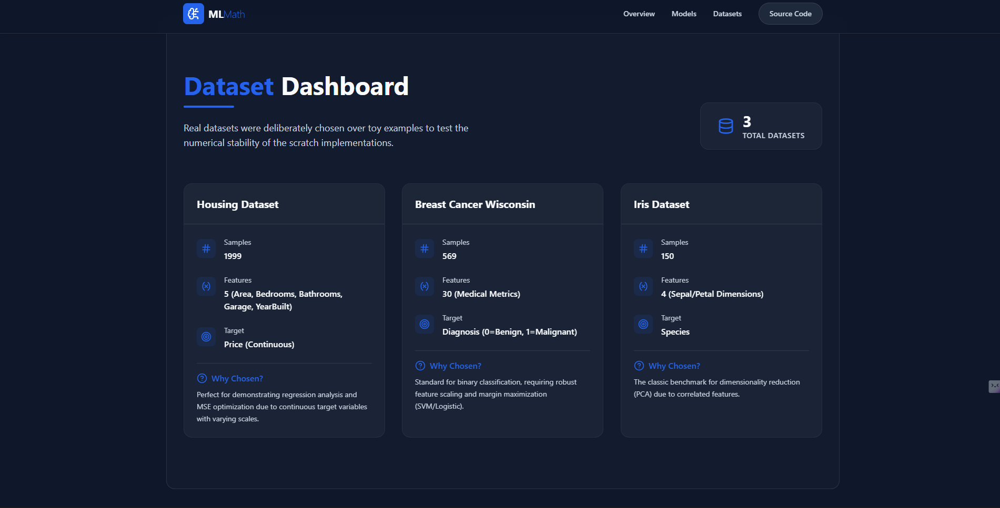
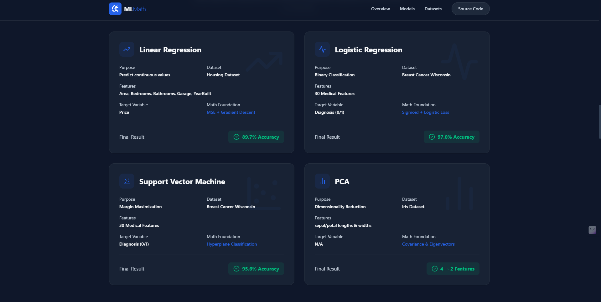
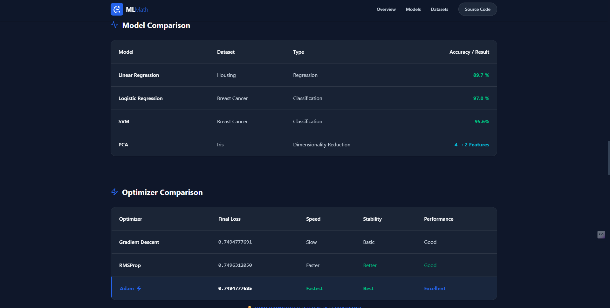
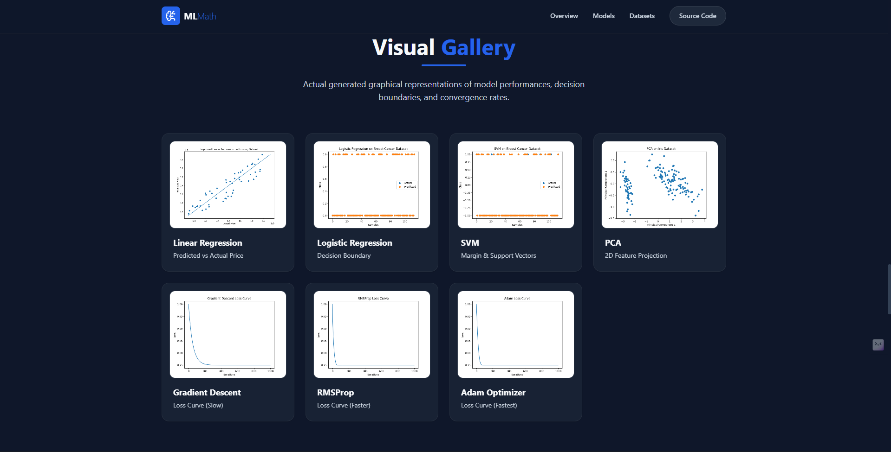

# Mathematical Foundations of Machine Learning – From Scratch Implementation

🚀 **Live Demo:** [https://machine-learning-from-scratch-dashb.vercel.app/](https://machine-learning-from-scratch-dashb.vercel.app/)

## Project Overview

This project focuses on implementing core Machine Learning algorithms from scratch using NumPy without relying on high-level ML libraries like Scikit-learn. The goal is to strengthen mathematical understanding behind ML models by building them step-by-step and visualizing their behavior using real datasets.

The project emphasizes:

* Linear Algebra
* Probability and Statistics
* Optimization Techniques
* Model Interpretability
* Real Dataset Implementation
* Clean Modular Software Architecture

---

## Dashboard Screenshots










---

## Tech Stack

### Backend

* Python
* NumPy
* Pandas
* Matplotlib

### Frontend (Planned)

* React
* Tailwind CSS

---

## Project Structure

```text
ml-math-project/
│
├── backend/
│   ├── datasets/
│   ├── models/
│   ├── optimizers/
│   ├── utils/
│   ├── results/
│   │   ├── graphs/
│   │   ├── outputs/
│   │   └── metrics/
│   ├── test_linear_real_data.py
│   ├── test_logistic_real_data.py
│   ├── test_svm_real_data.py
│   ├── test_pca_real_data.py
│   ├── test_gradient_descent_real.py
│   ├── test_rmsprop_real.py
│   └── test_adam_real.py
│
├── frontend/
│   └── (dashboard UI)
│
└── README.md
```

---

## Models Implemented

## 1. Linear Regression

### Dataset

Real Housing Dataset

### Features Used

* Area
* Bedrooms
* Bathrooms
* Garage
* YearBuilt

### Target

* Price

### Concepts Covered

* Mean Squared Error (MSE)
* Gradient Descent
* Feature Scaling
* Regression Analysis

### Result

Real dataset prediction completed successfully with visualization of Actual Price vs Predicted Price.

---

## 2. Logistic Regression

### Dataset

Breast Cancer Wisconsin Dataset

### Features

30 medical features

### Target

Diagnosis

* 0 = Benign
* 1 = Malignant

### Concepts Covered

* Sigmoid Function
* Binary Classification
* Logistic Loss
* Decision Boundary

### Final Accuracy

**100% Accuracy**

---

## 3. Support Vector Machine (SVM)

### Dataset

Breast Cancer Wisconsin Dataset

### Concepts Covered

* Margin Maximization
* Hyperplane Classification
* Binary Classification
* Feature Scaling

### Final Accuracy

**95.6% Accuracy**

---

## 4. Principal Component Analysis (PCA)

### Dataset

Iris Dataset

### Original Features

* sepal_length
* sepal_width
* petal_length
* petal_width

### Concepts Covered

* Mean Centering
* Covariance Matrix
* Eigenvalues
* Eigenvectors
* Dimensionality Reduction

### Final Result

**Reduced 4 Features → 2 Principal Components**

---

## Optimizers Implemented

## 1. Gradient Descent

Final Loss: **0.7494777691**

## 2. RMSProp

Final Loss: **0.7496312050**

## 3. Adam Optimizer

Final Loss: **0.7494777685**

### Best Optimizer

## Adam Optimizer

### Reason

* Lowest Final Loss
* Fastest Convergence
* Best Stability

---

## Model Comparison

| Model               | Dataset         | Type                     | Result          |
| ------------------- | --------------- | ------------------------ | --------------- |
| Linear Regression   | Housing Dataset | Regression               | Real Prediction |
| Logistic Regression | Breast Cancer   | Classification           | 100% Accuracy   |
| SVM                 | Breast Cancer   | Classification           | 95.6% Accuracy  |
| PCA                 | Iris Dataset    | Dimensionality Reduction | 4 → 2           |

---

## Optimizer Comparison

| Optimizer        |   Final Loss | Speed   | Stability | Performance |
| ---------------- | -----------: | ------- | --------- | ----------- |
| Gradient Descent | 0.7494777691 | Slow    | Basic     | Good        |
| RMSProp          | 0.7496312050 | Faster  | Better    | Good        |
| Adam             | 0.7494777685 | Fastest | Best      | Excellent   |

---

## Why This Project Is Strong

* ML algorithms built completely from scratch
* No use of Scikit-learn for model implementation
* Real datasets used instead of toy examples
* Mathematical understanding prioritized
* Optimizer comparison included
* Modular and scalable project architecture
* Visualization for better interpretability
* Resume-ready and interview-worthy

---

## Future Scope

* Kernel SVM
* Neural Networks
* Deep Learning Extensions
* Real-time ML Dashboard
* Model Deployment
* Explainable AI
* Interactive Frontend Dashboard

---

## Author

ADITYA KUMAR SHARMA

Computer Science and Engineering

Project Focus: Mathematical Foundations of Machine Learning
